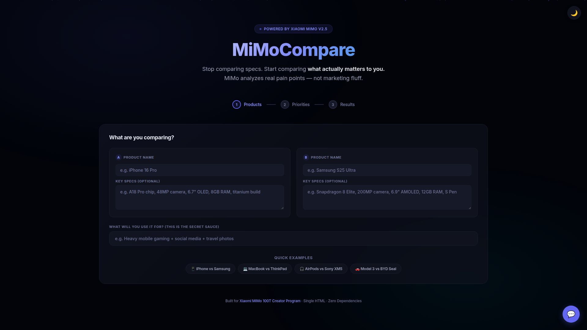
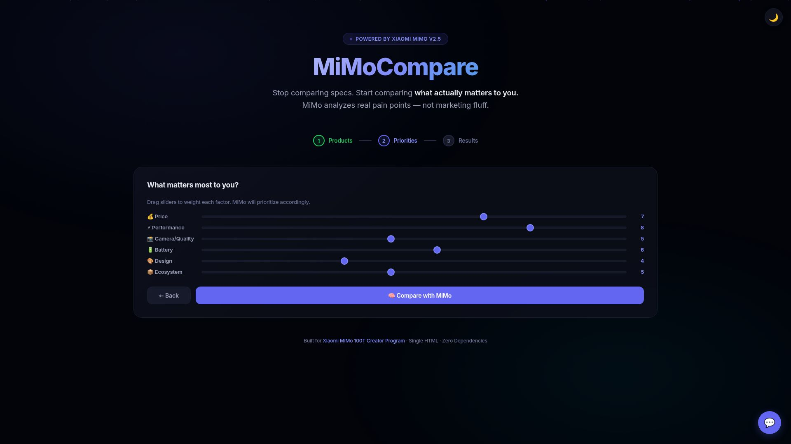
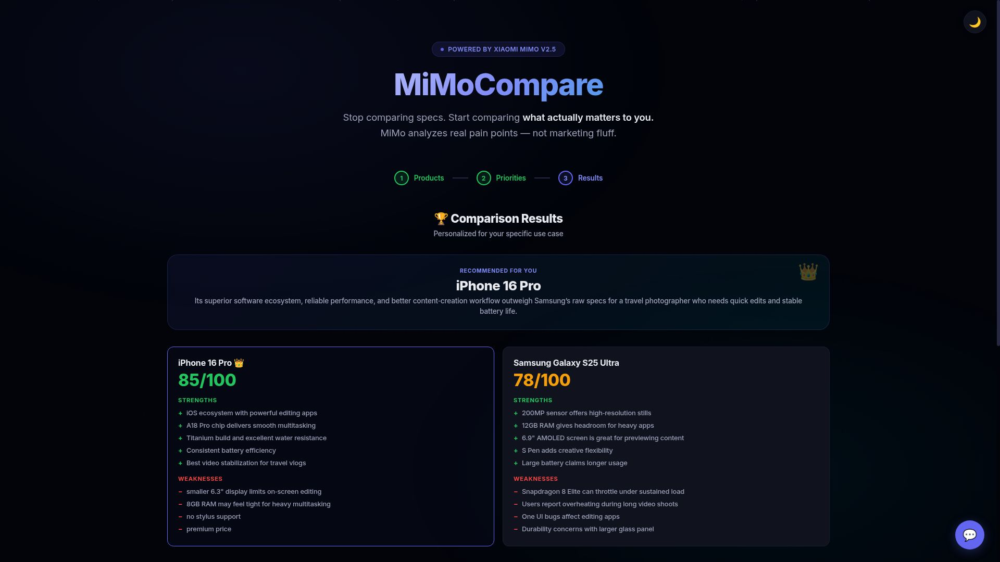
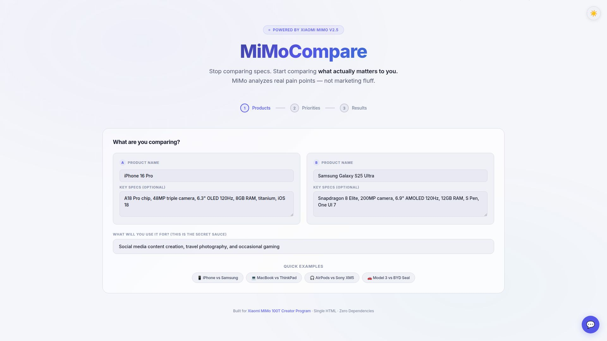
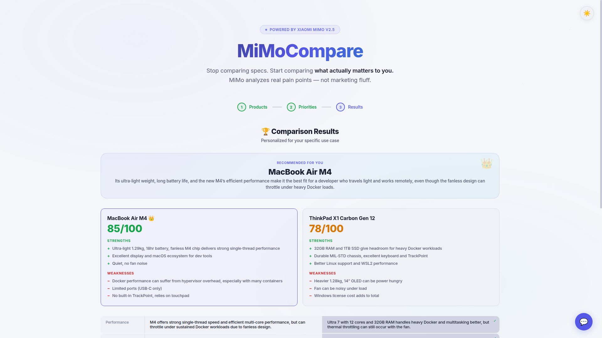
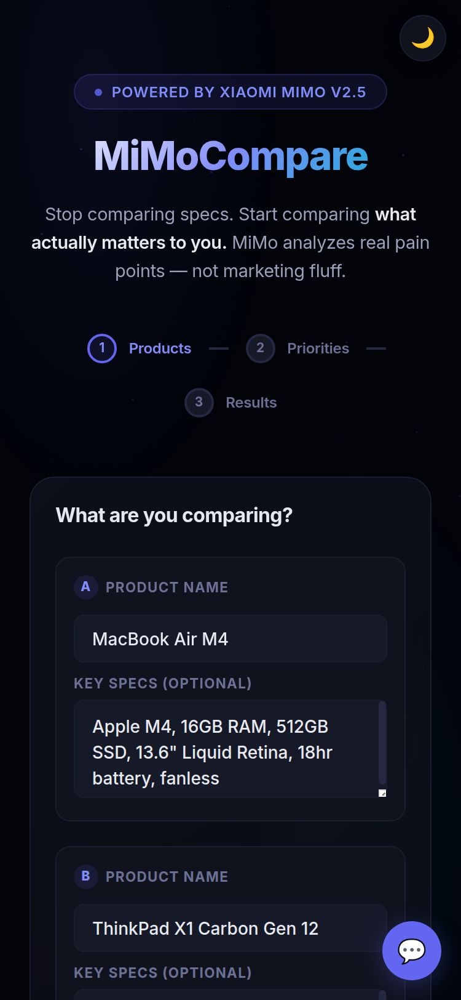

<div align="center">

# 🧠 MiMoCompare

### AI Product Decision Engine — Powered by Xiaomi MiMo V2.5

Stop comparing specs. Start comparing **what actually matters to you.**

Paste two products, describe how you'll actually use them, and MiMo gives you an opinionated recommendation based on real-world pain points — not marketing fluff.

[](https://gyoomei.github.io/mimocompare/)
[](https://100t.xiaomimimo.com)
[](LICENSE)

[](https://github.com/gyoomei/mimocompare/stargazers)
[](https://github.com/gyoomei/mimocompare/issues)
[](https://github.com/gyoomei/mimocompare/commits)
[](#)
[](#)

</div>

---

## 📖 The Problem

Every comparison tool on the internet does the same thing: **side-by-side spec sheets.**

```
Phone A: 6.7" OLED, 48MP, 8GB RAM, A18 Pro
Phone B: 6.9" AMOLED, 200MP, 12GB RAM, Snapdragon 8 Elite
```

Cool. But which one is better **for someone who shoots travel content and hates charging mid-day?**

Spec sheets can't answer that. **MiMo can.**

## 💡 The Solution

MiMoCompare doesn't compare specs. It compares **outcomes for YOUR specific use case.**

### How it works:

```
You enter:    "iPhone 16 Pro vs Samsung S25 Ultra"
You describe: "Heavy mobile gaming + travel photography"
You weight:   Performance: 9/10, Camera: 8/10, Battery: 6/10
MiMo:         → "Pick the S25 Ultra. Here's why for YOUR usage..."
```

**That's the entire UX — enter, describe, decide.**

---

## 🎯 What Makes It Different

| Feature | Spec Sheet Tools | MiMoCompare |
|---------|-----------------|-------------|
| Comparison basis | Marketing specs | Your actual use case |
| Input | Dropdown menus | Free-text description |
| Priority weighting | ❌ | ✅ Sliders 1-10 |
| Opinion | "Both are great" | Picks a clear winner |
| Real pain points | ❌ | ✅ "Users report overheating..." |
| Chat follow-up | ❌ | ✅ Ask anything |
| Dependencies | Backend + API keys | Single HTML, zero deps |

---

## ✨ Features

- **🧠 Use-Case Driven** — Describe HOW you'll use it, get personalized advice
- **⚖️ Priority Sliders** — Weight what matters: price, performance, camera, battery, design, ecosystem
- **🏆 Clear Winner** — No "both are great" — MiMo picks and defends
- **📊 Head-to-Head Table** — Category-by-category breakdown with winner indicators
- **💬 Chat with MiMo** — Follow-up questions about the comparison
- **⚡ Quick Examples** — One-click presets for phones, laptops, headphones, cars
- **🎨 Premium UI** — Dark/light toggle, animated gradients, glassmorphism, floating particles
- **📱 Fully Responsive** — Mobile (375px), tablet, desktop, large screens all supported
- **🔒 Zero Backend** — Runs entirely in browser, free forever

---

## 🖥️ Screenshots

| | |
|---|---|
|  |  |
| **Dark Theme — Hero** | **Dark Theme — Priorities** |
|  |  |
| **Dark Theme — Results** | **Light Theme — Hero** |
|  |  |
| **Light Theme — Results** | **Mobile (375px)** |

---

## 🔧 How It Works

```
┌─────────────────────────────────────────┐
│  1. User enters 2 products + use case   │
│  2. User sets priority weights (1-10)   │
│  3. Prompt sent to MiMo V2.5 via        │
│     Pollinations.ai free API            │
│  4. MiMo analyzes with context:         │
│     - Product specs                     │
│     - Real user complaints              │
│     - Use case alignment                │
│     - Priority weights                  │
│  5. Returns structured comparison:      │
│     - Winner + reason                   │
│     - Scores + pros/cons                │
│     - Category breakdown                │
│     - Narrative analysis                │
│  6. User can chat for follow-ups        │
└─────────────────────────────────────────┘
```

**No API keys. No backend. No data stored.**

---

## 🛠️ Tech Stack

- **HTML/CSS/JS** — Single file, zero dependencies
- **Xiaomi MiMo V2.5** — AI reasoning via Pollinations.ai
- **Inter font** — Clean, modern typography
- **CSS animations** — Mesh gradients, floating particles, glassmorphism
- **GitHub Pages** — Free hosting

---

## 🚀 Quick Start

```bash
# Clone
git clone https://github.com/gyoomei/mimocompare.git
cd mimocompare

# Open locally
open index.html

# Or deploy to any static host
# Just upload index.html — that's it
```

---

## 🧠 What MiMo Actually Does

MiMo doesn't just compare numbers. It reasons about:

- **Real-world trade-offs** — "200MP sounds better, but you'll never notice the difference over 48MP for Instagram"
- **Ecosystem lock-in** — "Switching from iPhone means losing iMessage, AirDrop, and Apple Watch"
- **Hidden costs** — "The cheaper phone needs a $50 case + $30 charger to match the competitor"
- **User-reported issues** — "S25 Ultra users report the S Pen tip wears out in 3 months"
- **Value alignment** — Based on YOUR priorities, not average consumer priorities

---

## 📊 Supported Categories

Works with any product comparison. Quick presets for:

- 📱 **Smartphones** — iPhone vs Samsung vs Pixel vs OnePlus
- 💻 **Laptops** — MacBook vs ThinkPad vs XPS vs Surface
- 🎧 **Headphones** — AirPods vs Sony vs Bose vs Sennheiser
- 🚗 **EVs** — Tesla vs BYD vs Hyundai vs Polestar

Or enter anything: cameras, tablets, monitors, keyboards, routers...

---

## 🔒 Privacy

- **Zero data collection** — Everything runs in your browser
- **No accounts** — No sign-up, no login, no tracking
- **No cookies** — No persistent storage
- **No backend** — API calls go directly to Pollinations.ai (free, no key required)

---

<div align="center">

**Built for [Xiaomi MiMo 100T Creator Program](https://100t.xiaomimimo.com)**

Single zero-dependency HTML · Free forever · No API key needed

</div>
